Overview
========

This walkthrough configures an ASP.NET MVC .NET Core Web App using Amazon
Cognito

Topics Covered
--------------

In this walk-through, you’ll build the following – An Amazon Cognito User Pool
to authenticate, store and manage users and configure a ASP.NET MVC .NET Core
Web App that can be hosted in AWS as well as how to do role based authentication
in Amazon Cognito using Cognito Groups

Pre-requisites
--------------

-   An AWS account with Administrative rights

-   Select the us-east-1 (N.Virginia) Region

-   Visual Studio 2019 Community Edition or better with the AWS toolkit
    installed

-   .NET Core 3.1 runtime

Task 1. Create Amazon Cognito User Pool
---------------------------------------

In this task, you’ll create and configure User Pool from AWS Management Console

Automating the Configuration using CloudFormation Template
----------------------------------------------------------

Follow the steps one by one in this section, and/or alternately, you can leverage the below cloud formation template 
to automate the Cognito Configuration


```

{
  "AWSTemplateFormatVersion": "2010-09-09",
  "Description": "Creates and configures cognito resources for the demo application.",
  "Parameters": {
    "AuthName": {
      "Type": "String",
      "Description": "Unique Auth Name for Cognito Resources"
    },
    "CallbackUrl": {
      "Type": "String",
      "Description": "Enter your callback URLS that you will include in your sign in and sign out requests."
    },
    "SignoutUrl": {
      "Type": "String",
      "Description": "Enter your sign out URLS that you will include in your sign in and sign out requests"
    }
  },
  "Resources": {
    "DemoUserPool": {
      "Type": "AWS::Cognito::UserPool",
      "Properties": {
        "UserPoolName": "NetCoreDemoAppUsersv1"
      }
    },
    "DemoUserPoolClient": {
      "Type": "AWS::Cognito::UserPoolClient",
      "Properties": {
        "ClientName": "NetCoreDemoAppClientv1",
        "ExplicitAuthFlows": [
          "ALLOW_USER_PASSWORD_AUTH",
          "ALLOW_REFRESH_TOKEN_AUTH"
        ],
        "GenerateSecret": false,
        "RefreshTokenValidity": "30",
        "UserPoolId": {"Ref": "DemoUserPool"},
        "SupportedIdentityProviders": [
          "COGNITO"
        ],
        "AllowedOAuthFlows": [
          "code"
        ],
        "AllowedOAuthScopes": [
          "email",
          "openid",
          "profile"
        ],
        "CallbackURLs": [
          {
            "Ref": "CallbackUrl"
          }
        ],
        "LogoutURLs": [
          {
            "Ref": "SignoutUrl"
          }
        ]
      }
    },
    "DemoUserPoolDomain": {
      "Type": "AWS::Cognito::UserPoolDomain",
      "Properties": {
        "Domain": { "Fn::Sub": "${AuthName}-demoappclient" },
        "UserPoolId": {
          "Ref": "DemoUserPool"
        }
      }
    }
  },
      "Outputs": {
        "UserPoolId": {
          "Description": "Id of api user pool",
          "Value": {
            "Ref": "DemoUserPool"
          },
          "Export": {
            "Name": "local-UserPoolId"
          }
        },
        "UserPoolClientId": {
          "Description": "Id of api user pool client",
          "Value": {
            "Ref": "DemoUserPoolClient"
          },
          "Export": {
            "Name": "local-UserPoolClientId"
          }
        },
        "UserPoolDomain": {
          "Description": "UserPoolDomain name",
          "Value": {
            "Ref": "DemoUserPoolDomain"
          },
          "Export": {
            "Name": "local-UserPoolDomain"
          }
        },
        "DemoRegion" : { "Description": "AWS Region name", "Value" : { "Ref" : "AWS::Region" } }
      }
}

```

#### Step 1: Open the AWS Console, navigate to the Cognito UI and click Manage User Pools

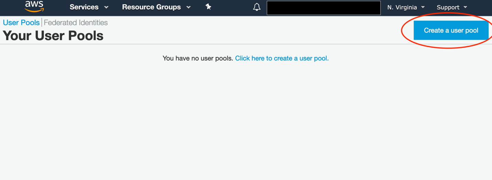

#### Step 2: Next click Create User Pool

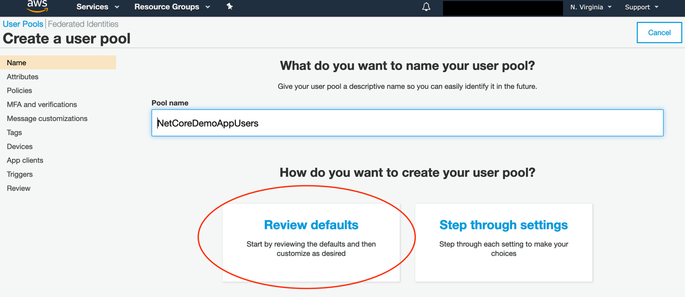

#### Step 3: Enter “NetCoreDemoAppUsers” for the Pool Name and click Review Defaults

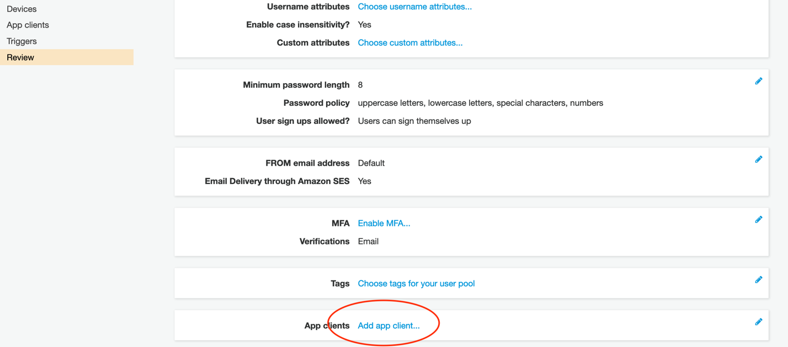

#### Step 4: Click on Add app client

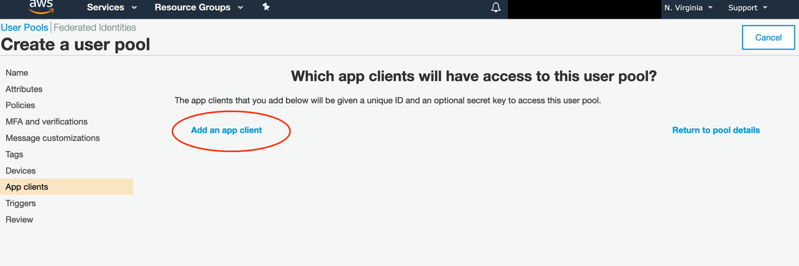

#### Step 5: Click on Add app client

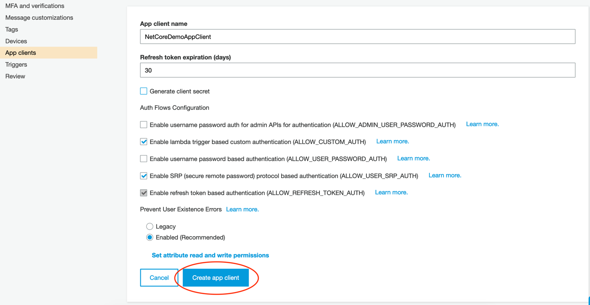

*Step 6: Enter the following and click Create app client* – App Client Name:
NetCoreDemoAppClient and Uncheck the Generate client secret checkbox

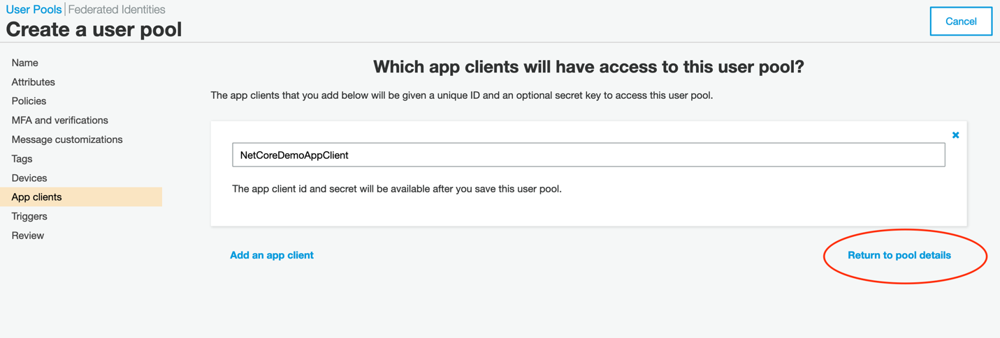

#### Step 7: Click Return to pool details

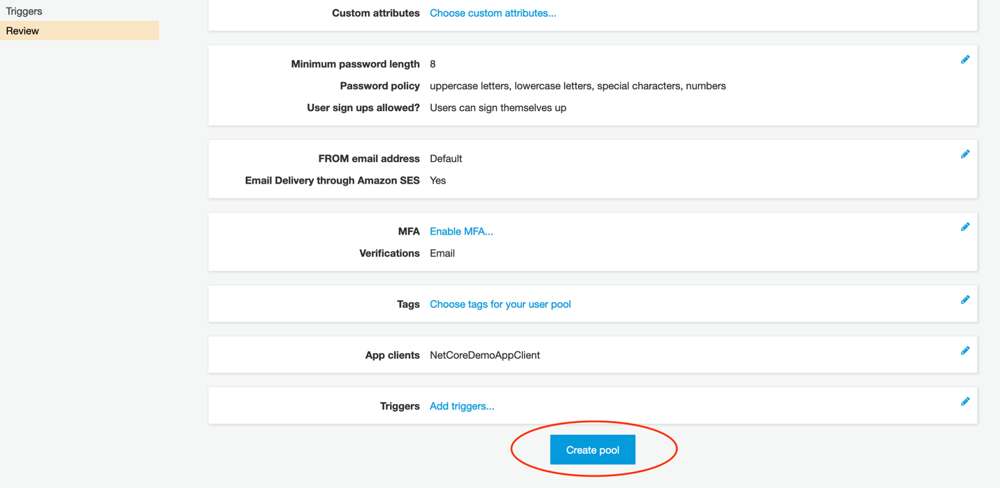

#### Step 8: Click Create Pool

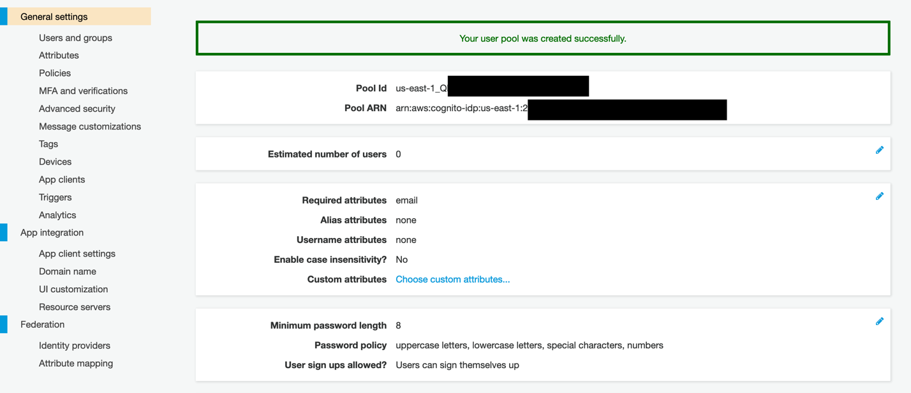

#### Step 9: Review the pool settings and copy the Pool id into the text editor and you will need this to configure your .NET App

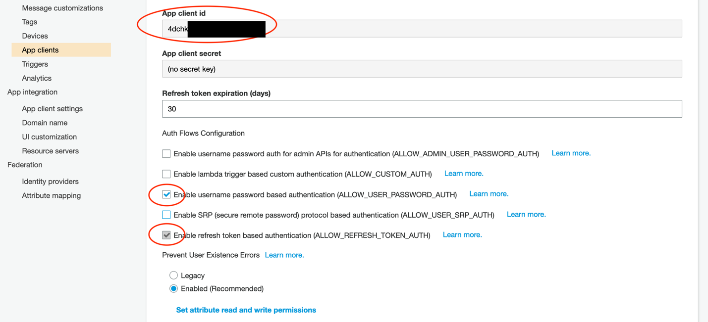


#### Step 10:Next, select the User Pool, that you've created from the previous step and under General Settings --> Users and Groups, create a group called "Admin" as shown in the screenshot below

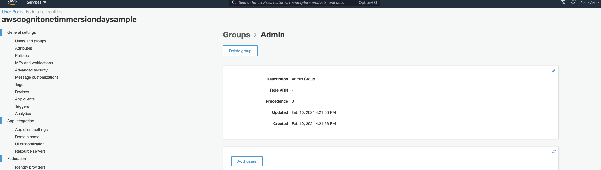

Task 2: Setup App Client
------------------------

#### Step 10: Go to App Client Settings, check the options highlighted and copy the ClientID and paste it in the text editor, we’ll use it when we configure the .NET App

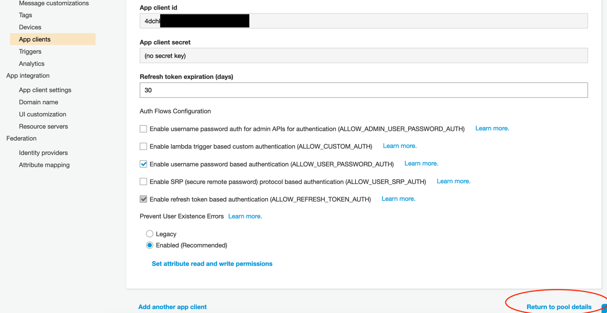

#### Step 11: When finished with the above step, click return to pool details

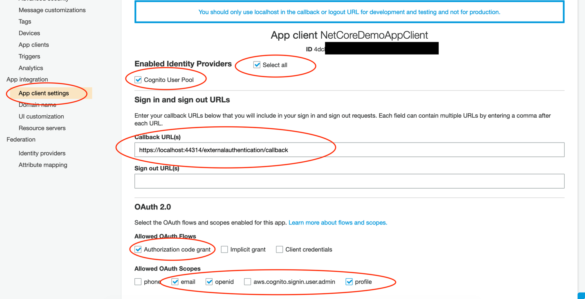

Task 3: Setup App Integration
-----------------------------

#### Step 12: Go to App client settings under App Integration, and check the following

-   Check the box – Select all, Cognito User Pool

-   Enter the callback url from your .NET App ex:
    <https://localhost:44314/externalauthentication/callback>

-   Under OAuth 2.0, check the following options

    -   Check the box – Authorization code grant

-   Under Allowed OAuth Scopes, check the following options

    -   email, openid, profile

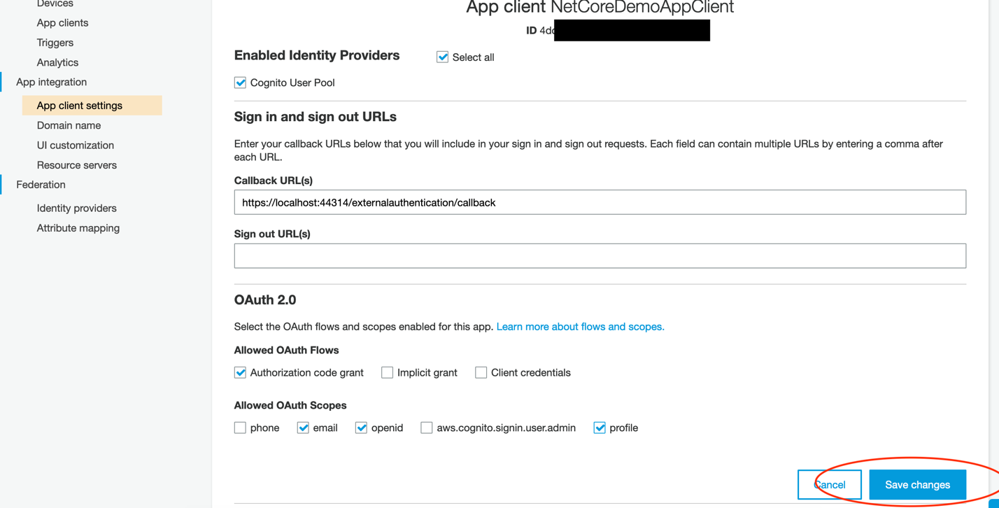

#### Step 13: Review the above steps and click save changes to apply the settings

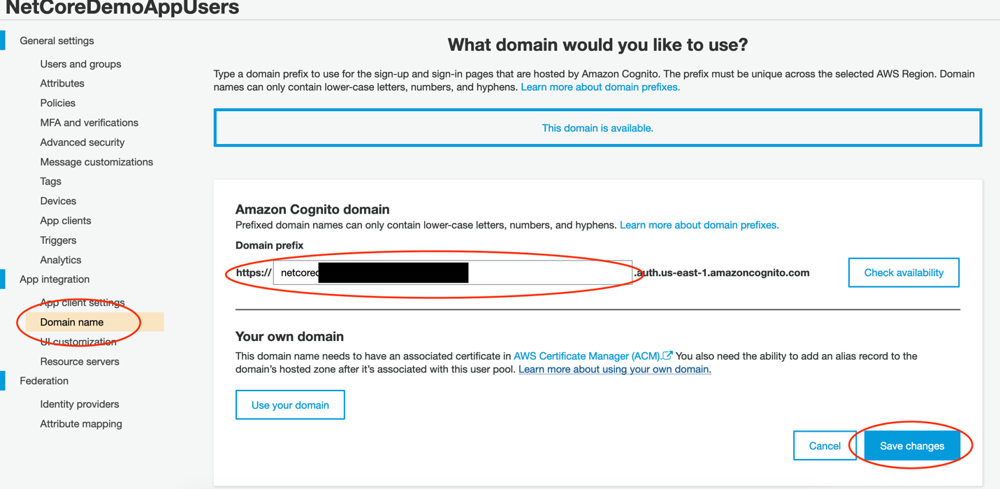

Task 4: Setup Amazon Cognito Domain
-----------------------------------

We will use this interface provided by Cognito to sign up and log in users. If
you plan to build your own UI, this is possible, and this step can be skipped
but this is outside the scope of this exercise

#### Step 14: Go to Domain name under App Integration, and enter the domain prefix and click to save changes

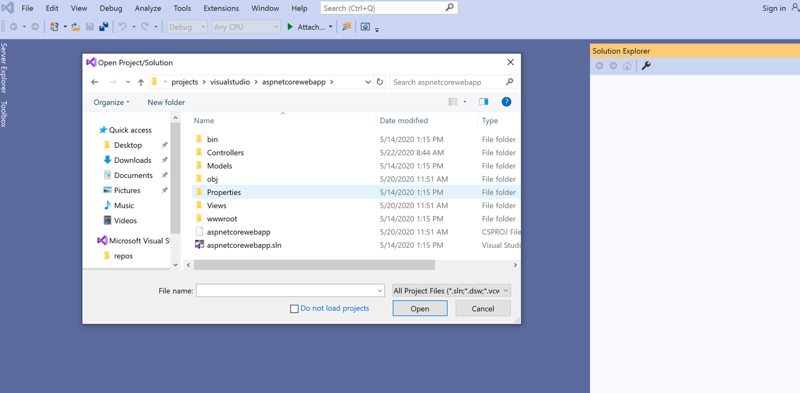

Note: For the purpose of this lab, we are using the US-EAST-1 (N.Virginia)
region, please make a note of which region you are working in we creating Url’s
and configuring applications.

Make a note of the following:

-   App Client ID

-   Pool Id

-   Callback Url

-   Sign Out Url

-   Cognito Domain (fully qualified cognito domain url)

Task 5: Create .NET Core ASP.NET MVC Web Application
----------------------------------------------------

In this task you’ll be creating a .NET Core ASP.NET MVC Web Application. This is
a sample project which will demonstrate the seamless integration of Amazon
Cognito

Pre-requisites:

-   Visual Studio 2019 Community Edition or higher

-   .NET Core 3.1

-   AWS Toolkit for Visual Studio

-   <https://aws.amazon.com/visualstudio/>

-   C\# Coding Skills

Note: You can do all of this on Mac OSX or Linux also. Once you have the .NET
Core Framework installed, you can install the AWS templates with the dotnet new
command.

#### Step 15: Download the project from S3 bucket or github.

Info: This bucket or repository contains the .NET Core ASP.NET MVC Web
Application Solution using OpenID. This is a simple web application to
demonstrate Amazon Cognito integration with the ASP.NET MVC Core Web App using
Microsot.AspNetCore.Authentication.OpenIdConnect

#### Step 15a: Open Visual Studio 2019, click FileOpenProject/Solution

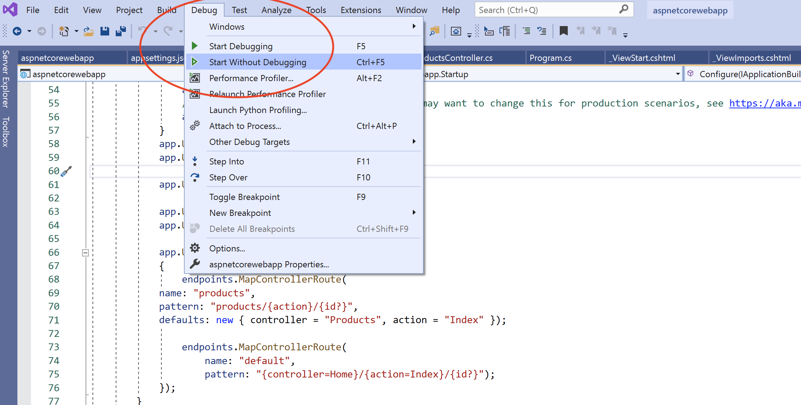

#### Step 16: Right click the project and build it and it should build without any errors.

#### Step 17: In the appsettings.json file, under the AuthenticationCognito section, provide values as below.

```

{
   "Logging":{
      "LogLevel":{
         "Default":"Warning"
      }
   },
   "AllowedHosts":"*",
   "Authentication":{
    "Cognito": {
      "ClientId": "\\<app client id from AWS Cognito\\>",
      "IncludeErrorDetails": true,
      "MetadataAddress": "https://cognito-idp.\\<your region\\>.amazonaws.com/\\<your-pool id\\>/.well-known/openid-configuration",
      "RequireHttpsMetadata": false,
      "ResponseType": "code",
      "SaveToken": true,
      "TokenValidationParameters": {
        "ValidateIssuer": true
      },
      "AppSignOutUrl": "\\<sign out relative url goes here \\>",
      "CognitoDomain": "\\<cognito domain goes here>\\"
    }
   }
}


```

There are few placeholders in the example above.

-   App client id from Amazon Cognito: This is your app client id which can be
    found by clicking App Clients under General Settings

-   Region: This is the aws region in which you configured amazon cognito
    resources

-   Pool Id: This is the pool id , can be found in the Cognito dashboard by
    clicking General Settings under the title Pool Id

Make sure you review these values for correctness.

Task 6: Review .NET Core Web Application and Configuration
----------------------------------------------------------

The sample application shows how to use the OpenID Connect ASP.NET Core
middleware to sign-in users using Amazon Cognito User Pool. The middleware is
initialized in the Startup.cs file by passing the Client Id and the Cognito
Metadata Url which is configured with the Pool Id from the above. The middleware
takes care of downloading the Cognito metadata, and processing the OpenID
requests and responses for sign up and sign in. You can trigger the middleware
to send an OpenID Connect Sign-in request by decorating the class or an action
method with the [Authorize] attribute.

Refer to the configuration details below.

#### Step 18: OpenID Connect Configuration
```
        // This method gets called by the runtime. Use this method to add services to the container.
        public void ConfigureServices(IServiceCollection services)
        {
            services.AddControllersWithViews();

            services.AddAuthentication(options =>
            {
                options.DefaultAuthenticateScheme = CookieAuthenticationDefaults.AuthenticationScheme;
                options.DefaultSignInScheme = CookieAuthenticationDefaults.AuthenticationScheme;
                options.DefaultChallengeScheme = OpenIdConnectDefaults.AuthenticationScheme;
            })
            .AddCookie()
            .AddOpenIdConnect(options =>
            {
                options.ResponseType = Configuration["Authentication:Cognito:ResponseType"];
                options.MetadataAddress = Configuration["Authentication:Cognito:MetadataAddress"];
                options.ClientId = Configuration["Authentication:Cognito:ClientId"];
                options.Events = new OpenIdConnectEvents()
                {
                    OnRedirectToIdentityProviderForSignOut = OnRedirectToIdentityProviderForSignOut
                };
            });

            services.AddAuthorization(options =>
            {
                options.AddPolicy("AdminOnly", policy =>
                    policy.RequireAssertion(context =>
                        context.User.HasClaim(c => c.Type == "cognito:groups" && c.Value == "Admin")));
            });
        }

        private Task OnRedirectToIdentityProviderForSignOut(RedirectContext context)
        {
            context.ProtocolMessage.Scope = "openid";
            context.ProtocolMessage.ResponseType = "code";

            var cognitoDomain = Configuration["Authentication:Cognito:CognitoDomain"];

            var clientId = Configuration["Authentication:Cognito:ClientId"];

            var logoutUrl = $"{context.Request.Scheme}://{context.Request.Host}{Configuration["Authentication:Cognito:AppSignOutUrl"]}";

            context.ProtocolMessage.IssuerAddress = $"{cognitoDomain}/logout?client_id={clientId}&logout_uri={logoutUrl}&redirect_uri={logoutUrl}";

            // delete cookies
            context.Properties.Items.Remove(CookieAuthenticationDefaults.AuthenticationScheme);
            // close openid session
            context.Properties.Items.Remove(OpenIdConnectDefaults.AuthenticationScheme);

            return Task.CompletedTask;
        }

```
#### Step 19: Authentication Middleware Configuration

```

        // This method gets called by the runtime. Use this method to configure the HTTP request pipeline.
        public void Configure(IApplicationBuilder app, IWebHostEnvironment env)
        {
            if (env.IsDevelopment())
            {
                app.UseDeveloperExceptionPage();
            }
            else
            {
                app.UseExceptionHandler("/Home/Error");
                // The default HSTS value is 30 days. You may want to change this for production scenarios, see https://aka.ms/aspnetcore-hsts.
                app.UseHsts();
            }
            app.UseHttpsRedirection();
            app.UseStaticFiles();

            app.UseRouting();

            app.UseAuthentication();
            app.UseAuthorization();

            app.UseEndpoints(endpoints =>
            {
                endpoints.MapControllerRoute(
            name: "products",
            pattern: "products/{action}/{id?}",
            defaults: new { controller = "Products", action = "Index" });

                endpoints.MapControllerRoute(
                    name: "default",
                    pattern: "{controller=Home}/{action=Index}/{id?}");
            });
        }

```

Task 7: Test the application
----------------------------

#### Step 20: Now we are ready to browse the site and test our configuration. From Step 16, in visual studio, run the application by selecting Debug Start without Debugging as shown below

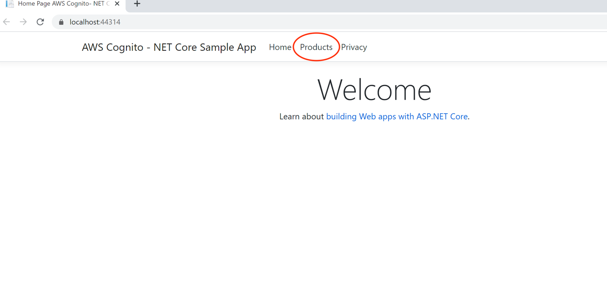

#### Step 21: Once the application is running and you can view it in the browser, click the Products menu item in the top navigation bar. This is just a placeholder link to simulate the sign-in and sign up experience using Amazon Cognito.

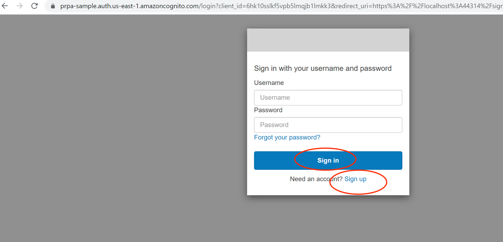

#### Step 22: The above step will trigger the OpenID Sign-in workflow and will display the Amazon Cognito hosted UI for sign-in and sign-up process. As mentioned earlier, you can customize this but this is outside the scope of this exercise.

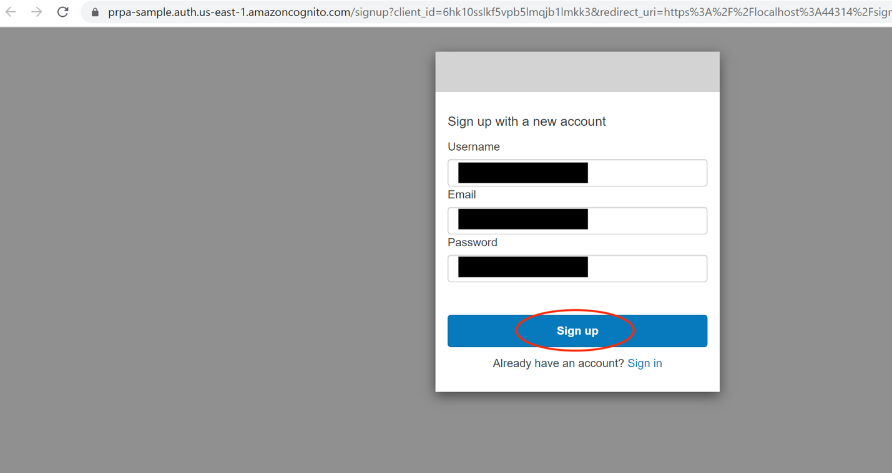

#### Step 23: As we don’t have a login, click the sign up link to register the user by entering the following information username, email, and password and click sign up 

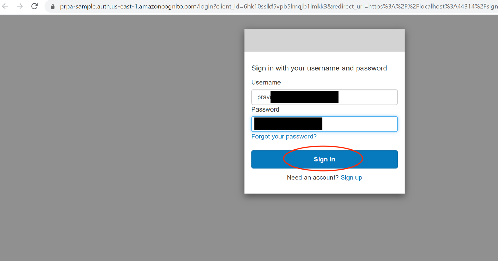

#### Step 24: Once the sign-up process is complete, you can login to the site like below


Once you've logged in, you can view some of the attributes of the logged in user as below

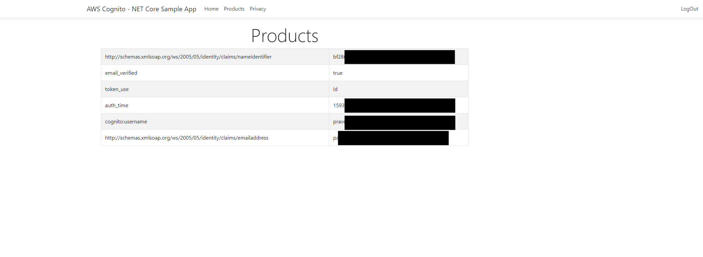


And also test for logout feature (which will redirect you to the home page after you click logout link in the top nav)

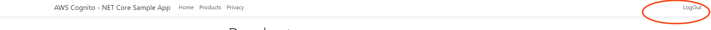

And you can view and manage all the users from the aws console

#### Step 25: You can view all the users in Amazon Cognito as shown below.


#### Step 26: Similar to the previous step, create another user and assign this user to the Cognito Group - Admin that you've created in Step 10.

If you try to access the /admin page with the login that you've created with Step 23, you'll not be able to login as this user is part of the Admin Cognito group.
But if you login using the user you've created using Step 26, and added this user to the Cognito Admin group in Step 10, you can now access the admin page as shown below.

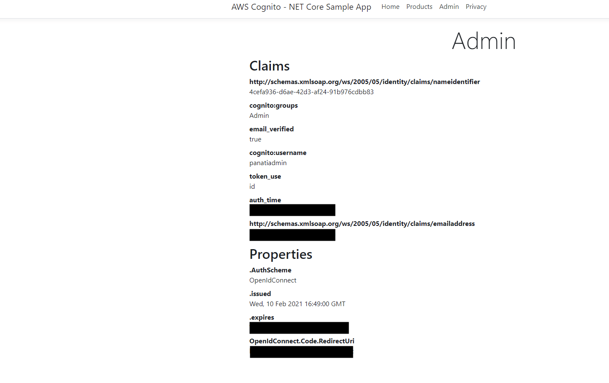

Summary
=======

In quick steps, we have demonstrated how you could integrate with Amazon Cognito
seamlessly for authentication and policy based authorization. In addition to this, you can
also integrate with federated identity providers, social logins to make it
easier for the users to login and register.


## Security

See [CONTRIBUTING](CONTRIBUTING.md#security-issue-notifications) for more information.

## License

This library is licensed under the MIT-0 License. See the LICENSE file.


